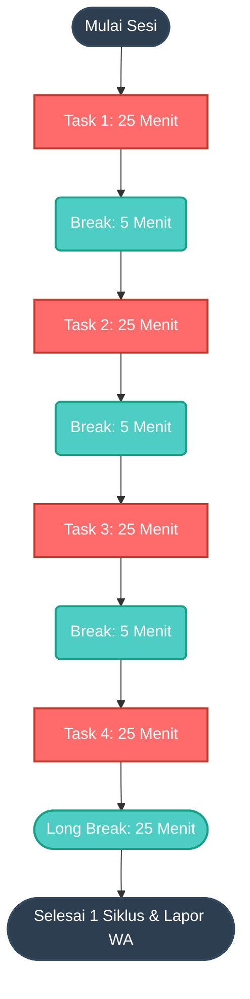

# pomodoro kit


Command line [pomodoro timer](https://en.wikipedia.org/wiki/Pomodoro_Technique), implemented in Go.

## Installation
Go to [Release Page](https://github.com/pomokit/pomodoro/releases)

## Usage

Aplikasi ini berjalan secara interaktif melalui *command line* (terminal). Berikut cara penggunaannya:

1. Jalankan file *executable* aplikasi (contoh: `./pomodoro` atau `pomodoro.exe`).
2. *(Hanya untuk penggunaan pertama kali)* Akan muncul QR Code WhatsApp di terminal. Lakukan pemindaian (scan) menggunakan aplikasi WhatsApp di ponsel Anda untuk menghubungkan akun.
3. Masukkan ID WhatsApp Group tujuan untuk pelaporan. **(Tips: Ketik `list` lalu Enter untuk menampilkan semua Grup WhatsApp Anda beserta ID-nya)**.
4. Masukkan URL Github terkait dengan tugas yang sedang dikerjakan.
5. Masukkan nama/deskripsi Milestone dari tugas Anda.
6. Timer akan mulai berjalan secara otomatis.

**Alur Aplikasi:**

**Infografis Siklus Pomodoro:**


- **Siklus Pomodoro:** 1 Sesi (cycle) terdiri dari **4 siklus kerja (masing-masing 25 menit) yang diselingi istirahat pendek (5 menit), dan diakhiri dengan 1 Istirahat Panjang (25 menit)**.
- **Notifikasi Awal:** Saat aplikasi mulai, sebuah pesan notifikasi akan dikirimkan ke WhatsApp Group yang telah ditentukan.
- **Tangkapan Layar Otomatis:** Selama timer pomodoro berjalan, aplikasi akan mengambil beberapa tangkapan layar (*screenshot*) secara *background*.
- **Pelaporan Akhir:** Setelah 1 sesi penuh selesai, aplikasi akan memilih satu *screenshot* secara acak dan mengirimkannya sebagai laporan progres ke WhatsApp Group, beserta informasi *milestone* dan tautan laporan.
- **Notifikasi Pergantian Waktu:** Terdapat peringatan berupa notifikasi desktop atau *beep* setiap kali sesi tugas berakhir dan memasuki waktu istirahat, serta sebaliknya.

## Dev & Maintenance

### Pengembangan Lokal (Local Development)
Untuk mengembangkan atau memodifikasi kode aplikasi ini:
1. Pastikan Golang sudah terinstal di sistem Anda.
2. Clone repositori ini ke komputer lokal.
3. Jalankan `go mod tidy` di terminal untuk mengunduh dan merapikan semua *dependencies* (termasuk modul whatsmeow untuk WhatsApp).
4. Jalankan aplikasi untuk diuji coba menggunakan perintah `go run .`
5. Untuk membuat file binary (*build*), jalankan `go build -o pomodoro .` (atau `pomodoro.exe` di Windows).

### Rilis Versi (Release)
Untuk merilis versi baru, Anda bisa menggunakan perintah *cross-compilation* dan melakukan *tagging* di Git. Berikut adalah contoh perintah rilis menggunakan PowerShell:

```sh
$env:GOOS = 'linux'
$env:GOOS = 'windows'
$env:GOOS = 'darwin'
$env:CGO_ENABLED = '1'

go mod tidy
git tag                                 # melihat versi saat ini
git tag v0.0.3                          # menetapkan versi tag baru
git push origin --tags                  # push tag ke repository untuk trigger rilis
```
